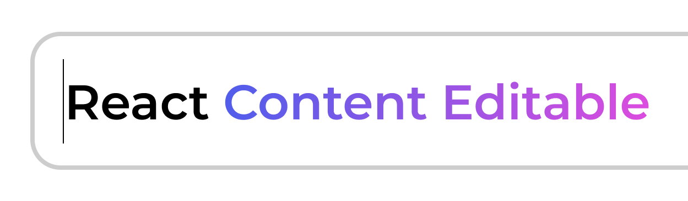

# React Basic Contenteditable



A React component that allows you to create an editable area in your application. It's perfect for situations where you need to provide a user-friendly, in-place editing functionality.

## Installation

Install via npm

```sh
npm install --save react-basic-contenteditable
```

or yarn

```sh
yarn add react-basic-contenteditable
```

## Usage

Live **demo** at: [https://chrisuser.github.io/react-basic-contenteditable/](https://chrisuser.github.io/react-basic-contenteditable/)

### Example

```javascript
import ContentEditable from "react-basic-contenteditable"

const App = () => {
  const [content, setContent] = useState("")

  return (
    <div>
      <div>{content}</div>
      <ContentEditable
        placeholder="Type here"
        containerClassName="container-class"
        contentEditableClassName="contenteditable-class"
        placeholderClassName="placeholder-class"
        onChange={(content) => setContent(content)}
      />
    </div>
  )
}

export default App
```

### Props

> All props except `onChange` are optional.

| Name                     | Optional | Type                | Description                                                           |
| ------------------------ | -------- | ------------------- | --------------------------------------------------------------------- |
| containerClassName       | ✔️       | `string`            | Custom classes for the wrapper div                                    |
| contentEditableClassName | ✔️       | `string`            | Custom classes for the input element                                  |
| placeholderClassName     | ✔️       | `string`            | Custom classes for the placeholder text                               |
| placeholder              | ✔️       | `string`            | Input placeholder text                                                |
| disabled                 | ✔️       | `boolean`           | Flag that disables the input element                                  |
| updatedContent           | ✔️       | `string`            | Text injected from parent element into the input as the current value |
| onContentExternalUpdate  | ✔️       | `(content) => void` | Method that emits the injected content by the `updatedContent` prop   |
| onChange                 | ❌       | `(content) => void` | Method that emits the current content as a string                     |
| onKeyUp                  | ✔️       | `(e) => void`       | Method that emits the keyUp keyboard event                            |
| onKeyDown                | ✔️       | `(e) => void`       | Method that emits the keyDown keyboard event                          |
| onFocus                  | ✔️       | `(e) => void`       | Method that emits the focus event                                     |
| onBlur                   | ✔️       | `(e) => void`       | Method that emits the blur event                                      |

## Contribution

If you have a suggestion that would make this component better feel free to fork the project and open a pull request or create an issue for any idea or bug you find.\
Remeber to follow the [Contributing Guidelines](https://github.com/ChrisUser/.github/blob/main/CONTRIBUTING.md).

## Licence

React Basic Contenteditable is [MIT licensed](https://github.com/ChrisUser/react-basic-contenteditable/blob/master/LICENSE).
