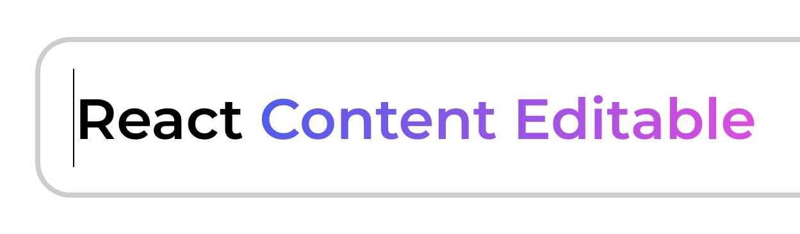

# React Basic Contenteditable



A React component that allows you to create an editable area in your application. It's perfect for situations where you need to provide a user-friendly, in-place editing functionality.

## Installation

Install via npm

```sh
npm install --save react-basic-contenteditable
```

or yarn

```sh
yarn add react-basic-contenteditable
```

## Usage

Live **demo** at [https://chrisuser.github.io/react-basic-contenteditable/](https://chrisuser.github.io/react-basic-contenteditable/)

### Example

```javascript
import ContentEditable from "react-basic-contenteditable"

const App = () => {
  const [content, setContent] = useState("")

  return (
    <div>
      <div>{content}</div>
      <ContentEditable
        placeholder="Type here"
        containerClassName="container-class"
        contentEditableClassName="contenteditable-class"
        placeholderClassName="placeholder-class"
        onChange={(content) => setContent(content)}
      />
    </div>
  )
}

export default App
```

### Ref & Imperative API

The component supports `forwardRef` to expose an imperative handle for programmatic control.

```typescript
import { useRef } from "react"
import ContentEditable from "react-basic-contenteditable"
import type { ContentEditableHandle } from "react-basic-contenteditable"

const App = () => {
  const editorRef = useRef<ContentEditableHandle>(null)

  return (
    <>
      <ContentEditable ref={editorRef} placeholder="Type here" />
      <button onClick={() => editorRef.current?.focus()}>Focus</button>
      <button onClick={() => editorRef.current?.insertAtCaret("👋")}>
        Insert emoji
      </button>
      <button onClick={() => editorRef.current?.clear()}>Clear</button>
    </>
  )
}
```

**Available methods:**

| Method             | Return   | Description                              |
| ------------------ | -------- | ---------------------------------------- |
| `focus()`          | `void`   | Focuses the editable element             |
| `blur()`           | `void`   | Removes focus from the editable element  |
| `insertAtCaret(text)` | `void` | Inserts text at the current cursor position |
| `clear()`          | `void`   | Clears all content                       |
| `getCaretPosition()` | `number` | Returns the current cursor offset       |

### Props

> All props are optional, that's how you can **fully customize** it!

| Name                     | Optional | Type                              | Description                                                                 |
| ------------------------ | -------- | --------------------------------- | --------------------------------------------------------------------------- |
| containerClassName       | ✔️       | `string`                          | Custom classes for the wrapper div                                          |
| contentEditableClassName | ✔️       | `string`                          | Custom classes for the input element                                        |
| placeholderClassName     | ✔️       | `string`                          | Custom classes for the placeholder text                                     |
| charsCounterClassName    | ✔️       | `string`                          | Custom classes for the character counter text (if `maxLength` is specified) |
| placeholder              | ✔️       | `string`                          | Input placeholder text                                                      |
| disabled                 | ✔️       | `boolean`                         | Flag that disables the input element                                        |
| maxLength                | ✔️       | `number`                          | Indicates the maximum number of characters a user can enter                 |
| autoFocus                | ✔️       | `boolean`                         | Flag to automatically focus the input element on mount                      |
| tagName                  | ✔️       | `string`                          | HTML tag for the editable element (default: `"div"`)                        |
| multiLine                | ✔️       | `boolean`                         | Allow multi-line input (default: `true`). Set to `false` for single-line   |
| sanitize                 | ✔️       | `(content: string) => string`     | Callback to sanitize content before `onChange` fires                        |
| updatedContent           | ✔️       | `string`                          | Text injected from parent element into the input as the current value       |
| onContentExternalUpdate  | ✔️       | `(content) => void`               | Method that emits the injected content by the `updatedContent` prop         |
| onChange                 | ✔️       | `(content, meta?) => void`        | Emits current content and optional `{ caretPosition }` metadata            |
| onKeyUp                  | ✔️       | `(e) => void`                     | Method that emits the keyUp keyboard event                                  |
| onKeyDown                | ✔️       | `(e) => void`                     | Method that emits the keyDown keyboard event                                |
| onFocus                  | ✔️       | `(e) => void`                     | Method that emits the focus event                                           |
| onBlur                   | ✔️       | `(e) => void`                     | Method that emits the blur event                                            |
| onPaste                  | ✔️       | `(e) => void`                     | Method that emits the paste event                                           |

The component also accepts any standard HTML attribute (`id`, `data-*`, `tabIndex`, `spellCheck`, `style`, `className`, etc.) which will be forwarded to the editable element.

### Types

The package exports the following TypeScript types:

```typescript
import type { ContentEditableHandle, ContentEditableProps } from "react-basic-contenteditable"
```

### Keyboard shortcuts

- Undo: `Ctrl + Z` (Windows/Linux) / `Cmd + Z` (macOS)
- Redo: `Ctrl + Y` / `Ctrl + Shift + Z` (Windows/Linux) / `Cmd + Shift + Z` (macOS)

## Contribution

If you have a suggestion that would make this component better feel free to fork the project and open a pull request or create an issue for any idea or bug you find.\
Remeber to follow the [Contributing Guidelines](https://github.com/ChrisUser/.github/blob/main/CONTRIBUTING.md).

## Licence

React Basic Contenteditable is [MIT licensed](https://github.com/ChrisUser/react-basic-contenteditable/blob/master/LICENSE).
